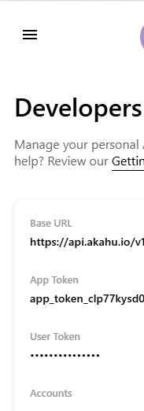
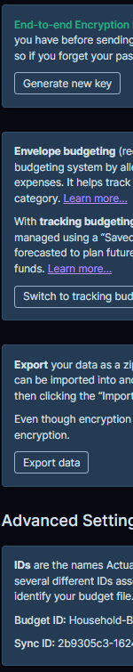
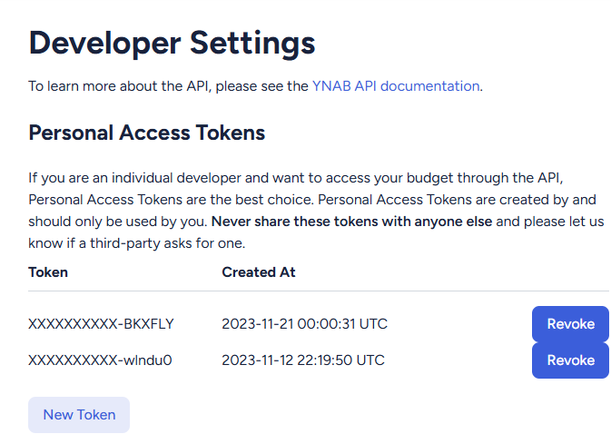

# akahu_to_budget
One-way sync of transactions from Akahu to either YNAB or Actual Budget.

We support both Actual Budget and YNAB.  You can sync to both or to just one.

# Project status

I started writing this script some time ago. As of 2024-12-28... I've finally swapped from using my old hodgepodge version to using this.
That means that today, it's feature complete but not yet battle-hardened.  If you're reading this notably after Dec 2024 then it should be pretty robust.

Also in terms of my personal setup, I haven't yet fully committed to giving up YNAB and an vascilating between YNAB and AB.  You might see oddities in the data 
created for AB (e.g. Payees, failing to trigger rules).  Please raise bugs.

# Setup

1. Create an Akahu account and an Akahu app: [https://my.akahu.nz/login](https://my.akahu.nz/login)
2. Set up an OpenAI account and get an API key: [https://platform.openai.com/account/api-keys](https://platform.openai.com/account/api-keys) (OPTIONAL)
3. Set up an Actual Budget Server and get the server URL, password, encryption key, and sync ID: [https://actualbudget.org/](https://actualbudget.org/).  I used PikaPods
4. And/OR in YNAB get a bearer token and the budget ID: [https://api.youneedabudget.com/](https://api.youneedabudget.com/)
5. Check out this repository
6. Create a virtual environment and run `pip install -r requirements.txt`
7. Create a `.env` file in the root of the project with the following variables:
```
ACTUAL_SERVER_URL="https://<your actual budget host>/"
ACTUAL_PASSWORD="your actual budget password"
ACTUAL_ENCRYPTION_KEY="your actual budget encryption key"
ACTUAL_SYNC_ID="the Sync ID of the budget you want to sync"
AKAHU_APP_TOKEN="your akahu app token"
AKAHU_PUBLIC_KEY="Reserved for Future Use"
AKAHU_USER_TOKEN="your akahu user token"
FLASK_ENV="development"
OPENAI_API_KEY="your openai key"
YNAB_BEARER_TOKEN="your ynab bearer token"
YNAB_BUDGET_ID="The budget you want to sync"
```
Note that the OPENAI key is optional.  I included it more for fun.  It makes the matching a bit smarter.  In the future
I might make it so it tries to guess your category based on the transaction memo.

You can find an exammple .env file in this repository called .env.example - just rename it to .env

# Setup (detail)

Note that I have both YNAB and AB.  In theory this script supports running with either or both, but it's only been
tested with both.  If you have only one then please get in contact and let me know how you got on.

## Akahu 
To sign up to Akahu you need to create what they call personal API or a 'user scoped endpoint' as documented here
https://developers.akahu.nz/reference/api-akahu-io-authentication

Here's a picture from my setup



## Actual Budget

I use pikapods for my setup.  You can sign up here: https://actualbudget.org/docs/install/pikapods/

Once you've signed up you can set up your accounts and create your budget.  If you're coming from YNAB then there's a tool: https://json-exporter-for-ynab.netlify.app/

I prefer to both have a password for my Actual Budget server AND to encrypt my data on Actual Budget.  That way even if
someone broke into PikaPods they wouldn't get automatic access to my financial data.  The code assumes you're doing this
too - you'll need to tweak it 

Now open your budget in YNAB and click 'show advanced settings'



## YNAB

You can create a personal API in YNAB as per the instructions https://api.ynab.com/

If you're the type of person who just wants to get up and running as quickly as possible and then circle back to fill in the gaps, these steps are for you:

1. Sign in to the YNAB web app and go to the "Account Settings" page and then to the "Developer Settings" page. 
2. Under the "Personal Access Tokens" section, click "New Token", enter your password and click "Generate" to get an access token.
3. Open a terminal window and run this:
curl -H "Authorization: Bearer <ACCESS_TOKEN>" https://api.ynab.com/v1/budgets



## OpenAI

I haven't bothered to document this because it's optional.  The setup is similar to YNAB.

## Python

I always use a virtual environment for each project. I used Python 3.12 here, but most versions of Python 3 should work.

```bash
python3.12 -m venv .venv

# Linux/Mac
source .venv/bin/activate

# Windows
.\.venv\Scripts\activate

# Once activated
pip install -r requirements.txt
```

# Preparing to run the script

Run `python akahu_budget_mapping.py`

This lets you interactively map your bank accounts with accounts set up in Actual Budget or YNAB.

It will ask you a bunch of questions like 
```Akahu Account: DAY TO DAY (Connection: Kiwibank)
Here is a list of actual accounts:
...
Enter the number corresponding to the best match (or press Enter to skip):
```

Ultimately this will write the file `akahu_budget_mapping.json`.

You will likely never need to run this again unless you want to change the mapping.

# Running the script

Now run `akahu_to_budget.py`

This is the workhorse.  It connects to Akahu, gets the transactions, and then syncs them to Actual Budget and/or YNAB.

It's implemented as a Flask app so you can run it locally and it will keep running.  
The first sync is triggered automatically on startup.  For subsequent syncs you should use the web interface.
There is minimal security, mostly because the webhooks don't take parameters so the worst someone can do is sync your budget prematurely.

You can run the sync by going to http://localhost:5000/sync

# Running Tests

There are some tests to validate the API is still working.  You can probably ignore them.

# OpenAI

I set up the OpenAI key for mapping accounts more out of self-amusement.  I have also toyed with the idea of using it to clean payees, assign transactions to categories, etc.
For now it's not really doing anything.